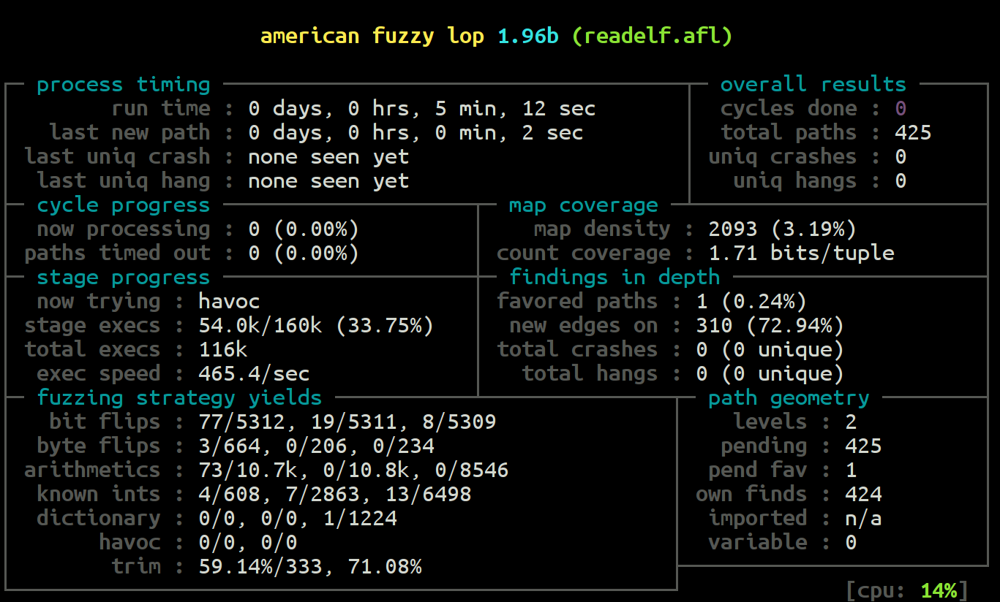

# E9AFL --- Binary AFL

E9AFL inserts [American Fuzzy Lop](https://github.com/google/AFL)
(AFL) instrumentation into `x86_64 Linux` binaries.
This allows binaries to be fuzzed without the need for recompilation.

E9AFL uses [E9Patch](https://github.com/GJDuck/e9patch) to insert the
AFL instrumentation via static binary rewriting.

## Download

Pre-built packages for E9AFL can be downloaded here:

* [https://github.com/GJDuck/e9afl/releases](https://github.com/GJDuck/e9afl/releases)

## Building

To build E9AFL, simply run the `build.sh` script:

        $ ./build.sh

To build the Debian package, simply run the `install.sh` script:

        $ ./install.sh

## Usage

First, install `afl-fuzz`:

        $ sudo apt-get install afl

To use E9AFL, simply run the command:

        $ ./e9afl /path/to/binary

This will generate an AFL-instrumented `binary.afl` which can be
used with `afl-fuzz`.

For more information on tool usage, see the man page:

        $ man -l doc/e9afl.l

## Example

To fuzz the binutils `readelf` program:

        $ ./e9afl readelf
        $ mkdir -p input
        $ mkdir -p output
        $ head -n 1 `which ls` > input/exe
        $ afl-fuzz -m none -i input/ -o output/ -- ./readelf.afl -a @@

If all goes well the output should look something like this:

## Detecting Memory Errors with RedFat

E9AFL can be combined with [RedFat](https://github.com/GJDuck/RedFat) for
enhanced memory error detection during fuzzing.
RedFat detects memory errors (bounds overflows and use-after-free) that would
not otherwise crash the program.

To enable, first install RedFat v0.3.0:

* [https://github.com/GJDuck/RedFat/releases](https://github.com/GJDuck/RedFat/releases)

Next, pass the `--redfat` option into E9AFL:

        $ ./e9afl --redfat readelf

This will instrument the binary with **both** AFL and RedFat instrumentation.

To use, preload the `libredfat.so` runtime library into AFL:

        $ AFL_PRELOAD=/usr/share/redfat/libredfat.so afl-fuzz -m none -i input/ -o output/ -- ./readelf.afl -a @@

## Troubleshooting

Some instrumented binaries may crash during AFL initialization:

        PROGRAM ABORT : Fork server crashed ...

This is often caused by an insufficient memory limit.
See AFL's `-m` option for more information.

## Further Reading

* Xiang Gao, Gregory J. Duck, Abhik Roychoudhury, [Scalable Fuzzing of Program Binaries with E9AFL](https://www.comp.nus.edu.sg/~gregory/papers/e9afl.pdf), Automated Software Engineering (ASE), 2021

## Bugs

Please report bugs [here](https://github.com/GJDuck/e9afl/issues).

## License

GLPv3

